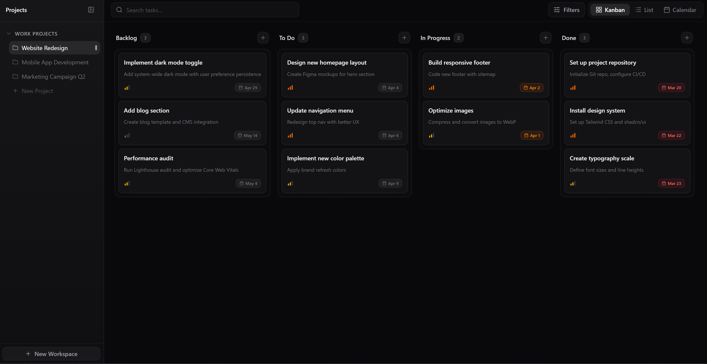
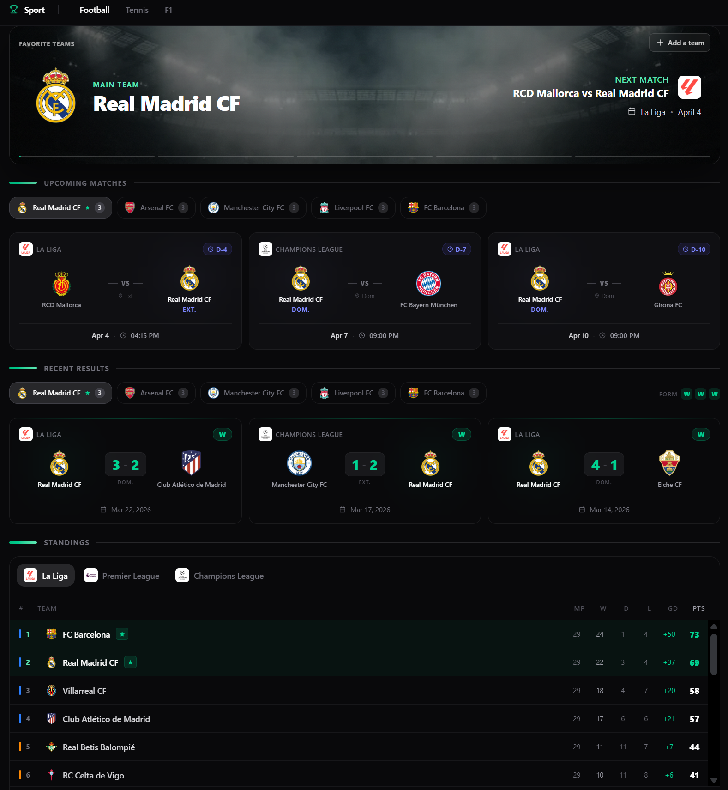
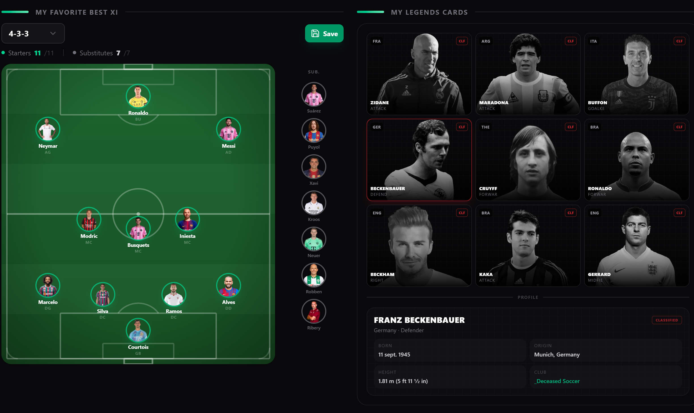
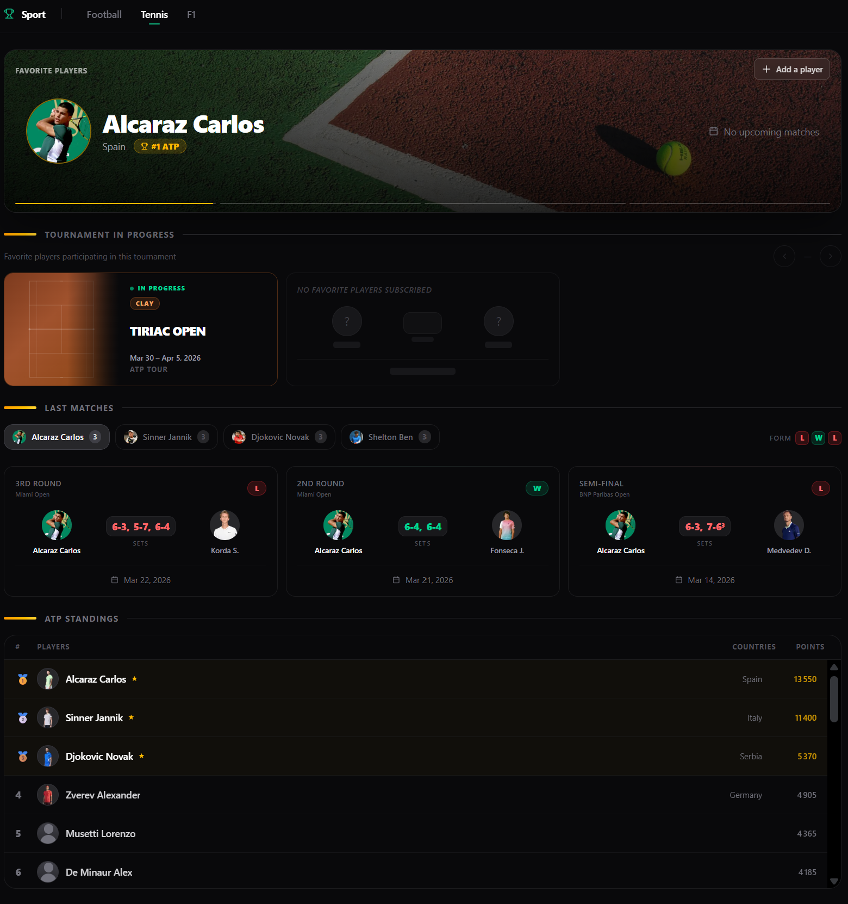
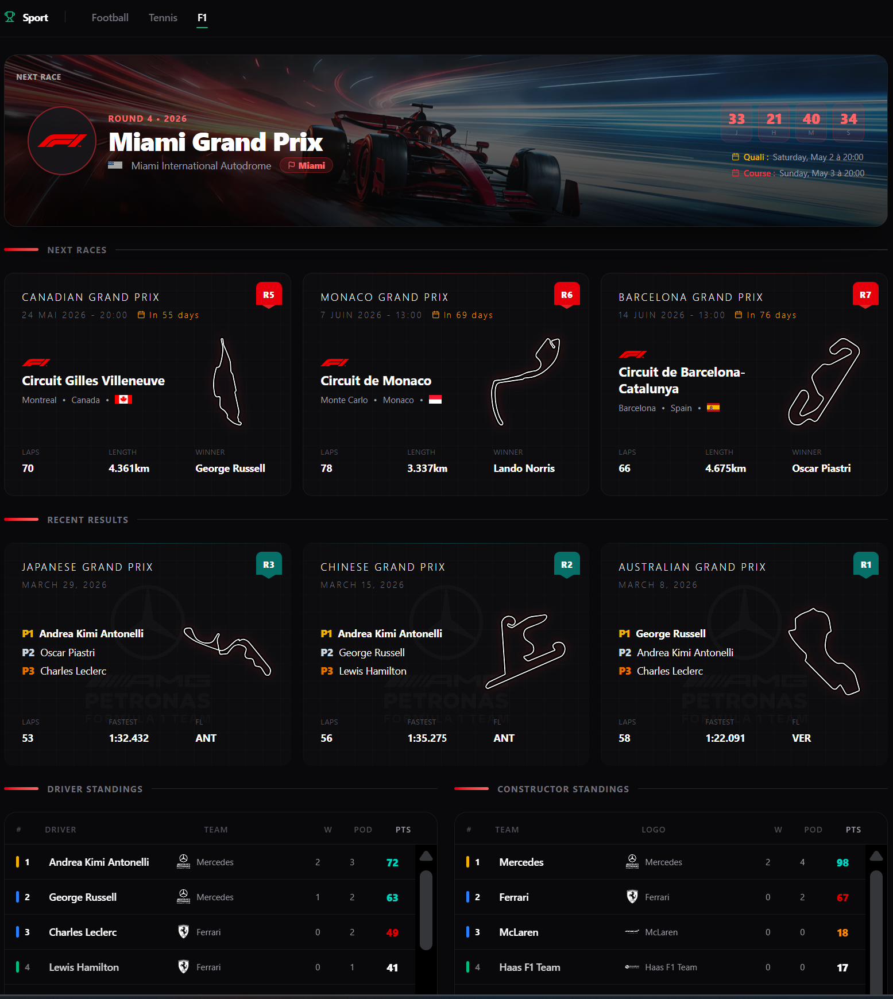
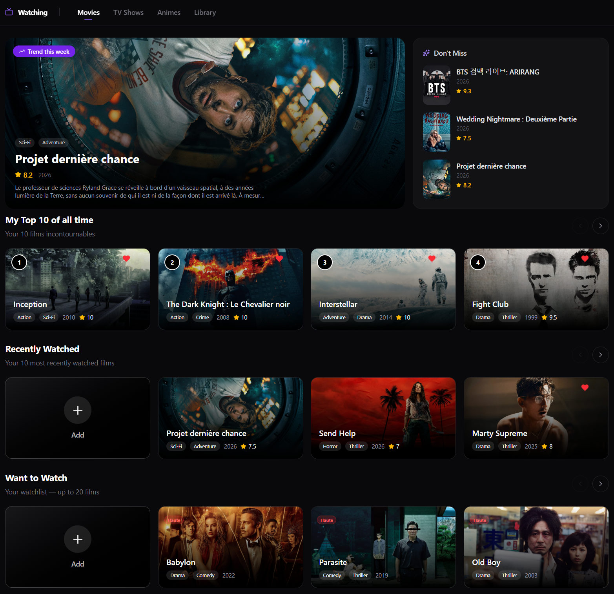
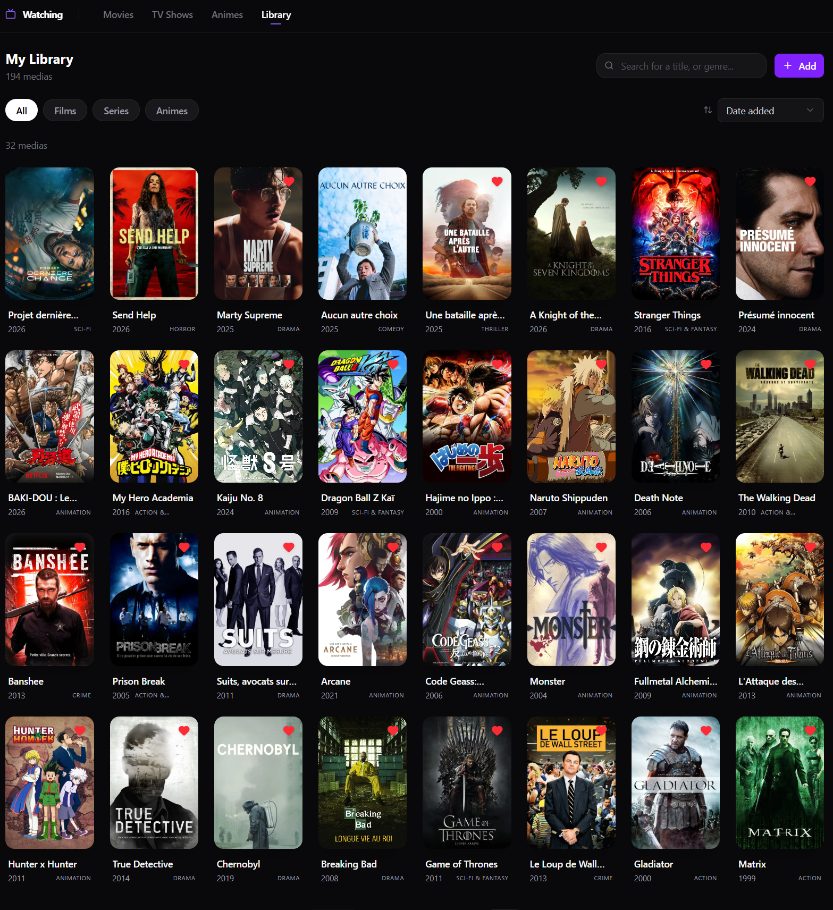

<div align="center">
  
  <h1>HEGON</h1>
  <p><strong>Personal digital second brain — all of life in one place.</strong></p>
  <p>Tasks · Sports · Watching · More coming</p>

  [](https://nextjs.org/)
  [](https://www.typescriptlang.org/)
  [](https://supabase.com/)
  [](https://tailwindcss.com/)
</div>

---

## What is HEGON?

HEGON is a personal productivity platform built for a single user. It brings together task management, sports tracking (football, tennis, F1), and an entertainment library (movies, series, anime) under one unified dark interface — no bloat, no distractions.

---

## Screenshots

### Dashboard
> *Screenshot coming soon*

---

### 📋 Tasks — Kanban Board

<div align="center">
  
</div>

---

### ⚽ Football

<div align="center">
  
</div>

<div align="center">
  
</div>

---

### 🎾 Tennis

<div align="center">
  
</div>

---

### 🏎️ Formula 1

<div align="center">
  
</div>

---

### 🎬 Watching

<div align="center">
  
</div>

<div align="center">
  
</div>

---

## Modules

### Dashboard
A unified overview of everything that matters:
- **Today section** — 3 dynamic slots: most urgent task, soonest sport event, media in progress
- **Upcoming in Sports** — horizontal scroll of next events across all 3 sports
- **Your Tasks** — tabs for Today / Upcoming / Completed with week progress bar

### Tasks
Full kanban board inspired by Linear:
- Workspaces → Projects → Statuses → Tasks hierarchy
- Drag & drop between columns (dnd-kit)
- Priority levels, due dates, personal notes

### Watching
Track movies, series, and anime with TMDB integration:
- **Top 10** — personal ranked list (drag to reorder)
- **In Progress** — what you're currently watching with season/episode tracking
- **Recently Watched**, **Want to Watch**, **Library** — full archive with filters
- All metadata (poster, backdrop, genres, rating) fetched automatically from TMDB

### Football
- Upcoming matches and recent results for followed teams
- League standings (La Liga, Premier League, Champions League)
- My Best XI — interactive lineup builder
- Team search & favorites management

### Tennis
- Favorite players with main player designation
- Upcoming / ongoing tournaments with surface info
- Recent results and ATP Top 25 rankings

### Formula 1
- Next races calendar with circuit maps
- Recent race results with podium and fastest lap
- Driver and constructor standings

---

## Tech Stack

| Layer | Technology |
|---|---|
| Framework | Next.js 15 (App Router) |
| Language | TypeScript 5 |
| Database | Supabase (PostgreSQL) |
| Auth | Supabase Auth |
| Styling | Tailwind CSS v4 |
| Animations | Framer Motion |
| Server state | TanStack Query v5 |
| Client state | Zustand |
| UI primitives | shadcn/ui |
| Drag & Drop | dnd-kit |
| External APIs | TMDB, API-Football, Jolpica (F1), TheSportsDB |

---

## Architecture

HEGON follows a **modular monolith** pattern. All business logic lives in `src/modules/`, thin pages in `src/app/`.

```
src/
├── app/                     ← Next.js App Router (pages only)
│   └── (main)/
│       ├── dashboard/
│       ├── perso/watching/
│       ├── perso/sports/{football,tennis,f1}/
│       └── pro/tasks/
├── modules/                 ← All business logic
│   ├── dashboard/
│   ├── tasks/
│   ├── watching/
│   └── sports/
│       ├── football/
│       ├── tennis/
│       └── f1/
├── shared/                  ← Shared utilities and components
└── infrastructure/
    └── supabase/
        ├── client.ts        ← Browser client
        └── server.ts        ← Server client
```

**Key patterns:**
- Server Components fetch data server-side, pass as props
- `service.ts` owns all Supabase queries — never inline in components
- TanStack Query for all client-side mutations and optimistic updates
- `React.cache()` deduplicates requests within a single render

---

<div align="center">
  <p>Built by <strong>Zakaria Zejly</strong> · Dark theme only · Single user</p>
</div>
