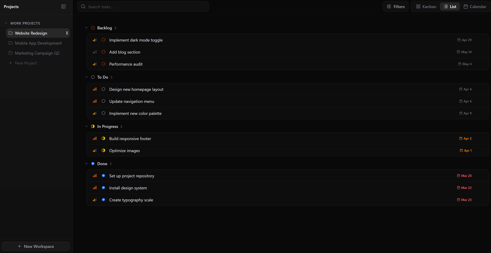
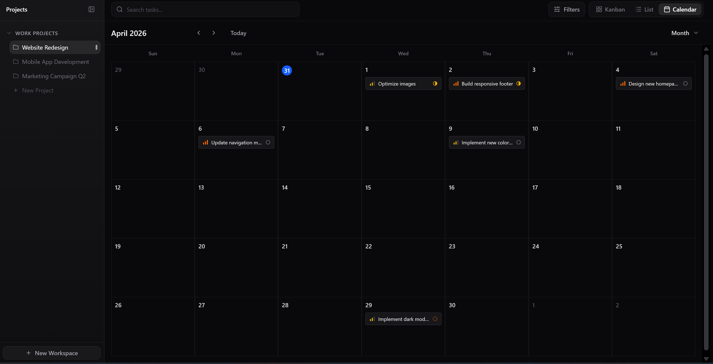
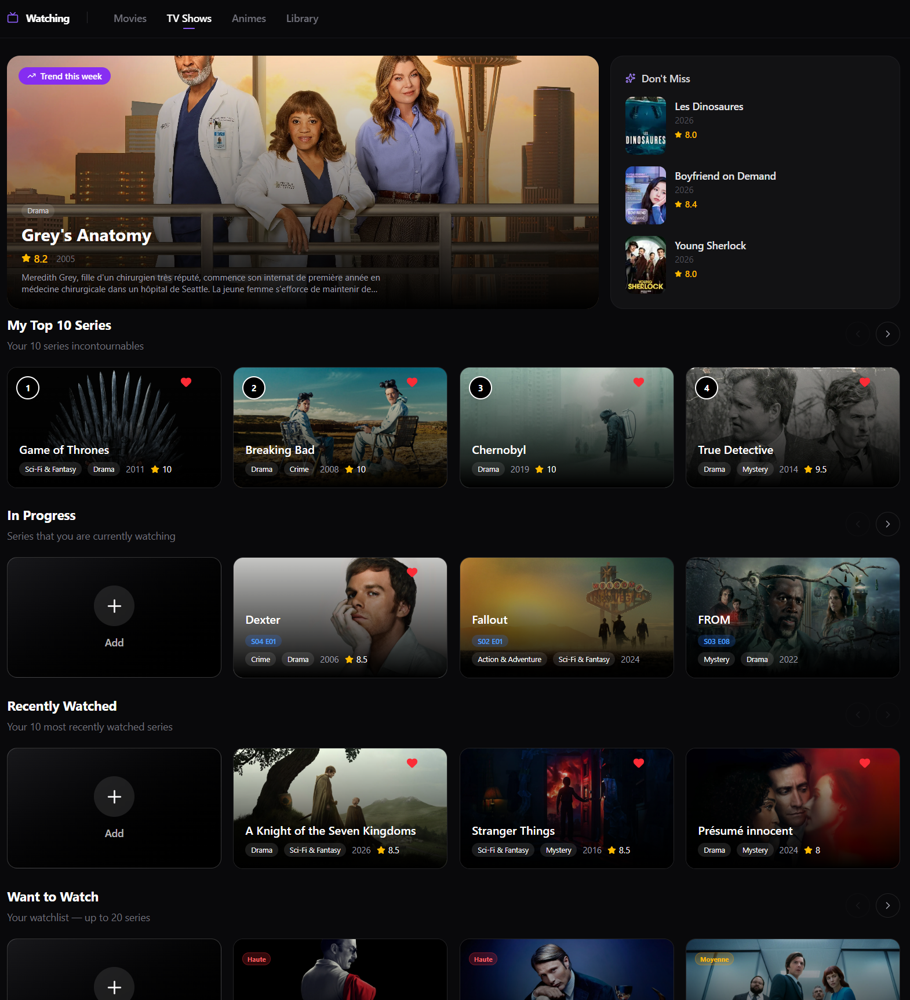
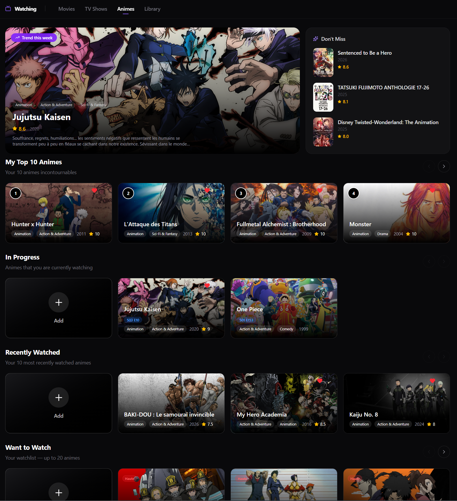

# 🧠 Digital Second Brain

A comprehensive personal productivity and entertainment tracking platform built with Next.js 14, featuring a PRO Tasks Manager, Sport Statistics (Football, Tennis, F1), and a Watching Tracker for movies, series, and anime.

[Live Demo](#) | [Documentation](#)

---

## 📸 Screenshots

### Tasks Manager MVP
*Linear-inspired task management with Kanban board, Calendar view, and List view*

<!-- Add screenshot: Kanban Board with drag & drop -->


<!-- Add screenshot: Calendar View with tasks -->


<!-- Add screenshot: List View grouped by status -->


### Sport Section

#### ⚽ Football
*Live standings, match results, Best XI builder, and Legends collection*

<!-- Add screenshot: Football hero with live standings -->


<!-- Add screenshot: Best XI interactive pitch -->


#### 🎾 Tennis
*ATP/WTA rankings, live matches, and tournament tracking*

<!-- Add screenshot: Tennis hub with rankings -->


#### 🏎️ Formula 1 2026
*Driver and constructor standings with real-time race results*

<!-- Add screenshot: F1 standings -->


### 📺 Watching Tracker
*Track movies, series, and anime with status management*

<!-- Add screenshot: Watching collection -->





---

## ✨ Features

### 🎯 Tasks Manager (MVP)
- **Kanban Board**: Drag & drop tasks between columns with smooth animations
- **Calendar View**: Monthly view with task mini-cards and date filtering
- **List View**: Grouped by status with priority indicators
- **Advanced Filters**: Search, priority, status, and tags with nested dropdowns (Linear-style)
- **CRUD Operations**: Create, edit, and delete tasks with full validation
- **Auto-Setup Onboarding**: First-time users get automatic workspace + project + statuses creation
- **Empty States**: Clean, minimalist empty states for onboarding and no-data scenarios
- **Real-time Updates**: React Query integration for optimistic updates and cache management

### ⚽ Football
- **Live Standings**: Real-time league tables with goal difference, points, and form
- **Match Results**: Recent fixtures with scores, dates, and competition info
- **Best XI Builder**: Interactive football pitch to create your dream team
- **Legends Collection**: War Room-style grid with player dossiers (stats, bio, achievements)
- **Responsive Design**: Mobile-first layout with touch-friendly interactions

### 🎾 Tennis
- **ATP/WTA Rankings**: Top 20 players with points and movement indicators
- **Live Matches**: Real-time scores with set-by-set breakdown
- **Tournament Tracking**: Upcoming and recent tournaments with surface info
- **Surface-Specific Design**: Clay, Hard, Grass, and Indoor with unique gradients

### 🏎️ Formula 1 2026
- **Driver Standings**: Points, wins, and team info
- **Constructor Standings**: Team rankings with total points
- **Race Results**: Automated sync via Supabase Edge Functions and cron jobs
- **Real-time Updates**: Sunday and Monday cron jobs for live race data

### 📺 Watching Tracker
- **Multi-Media Support**: Movies, TV Series, and Anime
- **Status Management**: Watching, Completed, Plan to Watch, Dropped
- **TMDB Integration**: Automatic metadata fetching (posters, overviews, ratings)
- **Collection View**: Card-based layout with filters and sorting

---

## 🛠️ Tech Stack

### Frontend
- **Framework**: Next.js 14 (App Router)
- **Language**: TypeScript
- **Styling**: Tailwind CSS
- **UI Components**: shadcn/ui
- **Animations**: Framer Motion
- **Drag & Drop**: dnd-kit
- **State Management**: Zustand
- **Data Fetching**: TanStack React Query v5

### Backend
- **Database**: Supabase (PostgreSQL)
- **Authentication**: Supabase Auth
- **Edge Functions**: Supabase Edge Functions (Deno)
- **Cron Jobs**: Supabase Cron for automated data sync
- **APIs**: 
  - API-Football (Football data)
  - Jolpica API (F1 data)
  - TMDB API (Movies, Series, Anime)

### DevOps
- **Version Control**: Git
- **Deployment**: Vercel
- **Database Migrations**: Supabase Migrations
- **Environment**: `.env.local` for secrets

---

## 🏗️ Architecture

### Database Schema
- **`workspaces`**: User workspace organization
- **`projects`**: Projects within workspaces
- **`statuses`**: Custom status columns per project
- **`tasks`**: Tasks with full metadata (priority, dates, position, tags)
- **`tags`**: User-defined tags with colors
- **Sport schema**: 
  - Football: `competitions`, `teams`, `standings`, `matches`, `legends`
  - Tennis: `players`, `rankings`, `matches`, `tournaments`
  - F1: `drivers`, `teams`, `races`, `standings`
- **`watching`**: Movies, series, and anime tracking

### Key Design Patterns
- **Server Components**: Async data fetching in RSC
- **Suspense Boundaries**: Progressive loading with skeleton states
- **Optimistic Updates**: Instant UI feedback with React Query
- **Single Skeleton Pattern**: One skeleton per view, no double rendering
- **Linear-Inspired UX**: Nested filters, smooth animations, keyboard shortcuts

---

## 🚀 Getting Started

### Prerequisites
- Node.js 18+
- npm or yarn
- Supabase account

### Installation

1. **Clone the repository**
   ```bash
   git clone https://github.com/yourusername/digital-second-brain.git
   cd digital-second-brain
   ```

2. **Install dependencies**
   ```bash
   npm install
   ```

3. **Set up environment variables**
   ```bash
   cp .env.example .env.local
   ```
   
   Fill in your Supabase and API keys:
   ```env
   NEXT_PUBLIC_SUPABASE_URL=your_supabase_url
   NEXT_PUBLIC_SUPABASE_ANON_KEY=your_supabase_anon_key
   SUPABASE_SERVICE_ROLE_KEY=your_service_role_key
   NEXT_PUBLIC_API_FOOTBALL_KEY=your_api_football_key
   NEXT_PUBLIC_TMDB_API_KEY=your_tmdb_api_key
   ```

4. **Run database migrations**
   ```bash
   # Apply all migrations in Supabase Dashboard SQL Editor
   # Or use Supabase CLI
   supabase db push
   ```

5. **Seed the database (optional)**
   ```bash
   # Run tasks-seed-FINAL.sql in Supabase SQL Editor
   # This creates sample workspaces, projects, and tasks
   ```

6. **Start the development server**
   ```bash
   npm run dev
   ```

7. **Open your browser**
   ```
   http://localhost:3000
   ```

---

## 📁 Project Structure

```
digital-second-brain/
├── app/                          # Next.js 14 App Router
│   ├── (auth)/                   # Auth routes
│   ├── tasks/                    # Tasks section
│   ├── sport/                    # Sport section
│   │   ├── football/
│   │   ├── tennis/
│   │   └── f1/
│   └── watching/                 # Watching tracker
├── components/                   # React components
│   ├── tasks/                    # Tasks components
│   │   ├── kanban/
│   │   ├── calendar/
│   │   ├── list/
│   │   ├── modals/
│   │   └── TasksSkeletons.tsx
│   ├── sport/                    # Sport components
│   │   ├── football/
│   │   ├── tennis/
│   │   └── f1/
│   └── ui/                       # shadcn/ui components
├── lib/                          # Utilities and configs
│   ├── tasks/
│   │   ├── queries/              # React Query hooks
│   │   ├── actions/              # Server actions
│   │   ├── stores/               # Zustand stores
│   │   └── types/                # TypeScript types
│   ├── sport/
│   └── supabase/                 # Supabase client configs
├── supabase/
│   ├── functions/                # Edge Functions
│   │   ├── sync-f1-race-results/
│   │   ├── sync-tennis-matches/
│   │   └── sync-football-data/
│   └── migrations/               # Database migrations
└── public/                       # Static assets
```

---

## 🎨 Design System

### Color Palette
- **Background**: Zinc-950 (dark mode)
- **Cards**: Zinc-900/40 with backdrop blur
- **Borders**: White/5-8 opacity
- **Accents**: 
  - Violet (#8b5cf6) - Website projects
  - Cyan (#06b6d4) - Mobile projects
  - Orange (#f59e0b) - Marketing projects
  - Blue (#3b82f6) - Primary actions

### Typography
- **Font**: Inter (default Next.js font)
- **Sizes**: Tailwind's type scale
- **Weights**: 400 (normal), 500 (medium), 600 (semibold), 700 (bold)

### Components
- **Buttons**: shadcn/ui Button with variants
- **Inputs**: shadcn/ui Input with focus rings
- **Cards**: Rounded-lg with border and subtle shadow
- **Modals**: shadcn/ui Dialog with backdrop blur
- **Skeletons**: Zinc-800/80 with pulse animation

---

## 🔐 Security

- **Row Level Security (RLS)**: All tables have RLS policies
- **User Isolation**: Users can only access their own data
- **API Keys**: Stored in environment variables, never committed
- **Server Actions**: Input validation and sanitization
- **Supabase Auth**: Secure authentication with magic links or OAuth

---

## 🧪 Testing

Currently, this is a personal project without formal tests. Future improvements:
- Unit tests with Vitest
- Integration tests with Playwright
- E2E tests for critical flows

---

## 🚧 Roadmap

### Tasks Manager
- [ ] Subtasks (parent-child relationships)
- [ ] Time tracking (start/stop timers)
- [ ] Task dependencies
- [ ] Custom fields
- [ ] Keyboard shortcuts
- [ ] Dark/Light mode toggle

### Sport Section
- [ ] More leagues (NBA, NFL, etc.)
- [ ] Player statistics
- [ ] Head-to-head comparisons
- [ ] Notifications for live matches

### Watching Tracker
- [ ] Recommendations engine
- [ ] Social features (share lists)
- [ ] Advanced filters (genre, year, rating)
- [ ] Episode tracking for series

### General
- [ ] Full internationalization (i18n)
- [ ] Mobile apps (React Native)
- [ ] Offline mode (PWA)
- [ ] Data export (CSV, JSON)
- [ ] API for third-party integrations

---

## 🤝 Contributing

This is a personal portfolio project, but feedback and suggestions are welcome!

1. Fork the project
2. Create your feature branch (`git checkout -b feature/AmazingFeature`)
3. Commit your changes (`git commit -m 'feat: add some amazing feature'`)
4. Push to the branch (`git push origin feature/AmazingFeature`)
5. Open a Pull Request

---

## 📝 License

This project is open source and available under the [MIT License](LICENSE).

---

## 👤 Author

**Zakaria**
- Master's in Information Systems and Security
- Stack: Java/Spring Boot, React, Next.js, TypeScript
- Looking for first CDI developer position in France
- [LinkedIn](#) | [Portfolio](#) | [GitHub](#)

---

## 🙏 Acknowledgments

- [Next.js](https://nextjs.org/) - React framework
- [Supabase](https://supabase.com/) - Backend as a Service
- [shadcn/ui](https://ui.shadcn.com/) - UI component library
- [Tailwind CSS](https://tailwindcss.com/) - Utility-first CSS
- [Framer Motion](https://www.framer.com/motion/) - Animation library
- [Linear](https://linear.app/) - Design inspiration for Tasks Manager
- API-Football, Jolpica API, TMDB - Data providers

---


